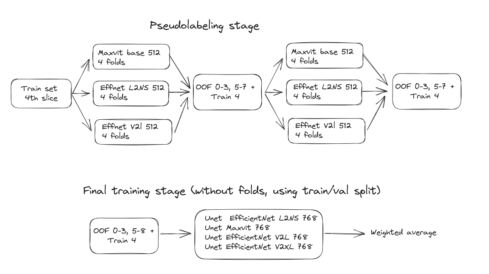

### 4th place Solution, [Google Research - Identify Contrails to Reduce Global Warming](https://www.kaggle.com/competitions/google-research-identify-contrails-reduce-global-warming/)



### 1st stage, pseudolabeling

The training parameters assume that an instance with 4 gpus with 48GB are used. 
Due to usage of bfloat16 only Ampere+ generation is supported.

#### Bootstrap pseudolabels
At this stage 4 folds of UNets were trained for 3 different encoders
- 512x512 resolution
- encoders: EfficientNet V2L, MaxVit Base, EfficientNet L2NS
- loss: 50*BCE + 0.2*Dice
- Optimizer: AdamW, wd=1e-2, cosine LR 1e-4, 70 epochs
- Augmentations: HFlip, 90, 270
- each fold on a single GPU, mixed precision with bfloat16 

Predict OOF ensemble with 4TTA

#### second round pseudolabels
Same params as for bootstrap step though with 50% during training pseudo labels were used (only for 0-3, 5-7 frames) 


### Final stage
#### Training
- using train/val split
- 768x768 resolution
- encoders: EfficientNet V2L, MaxVit Base, EfficientNet L2NS, EfficientNet V2XL,
- loss: 50*BCE + 0.2*Dice
- Optimizer: AdamW, wd=1e-2, cosine LR 1e-4, 70 epochs
- Augmentations: HFlip, 90, 270
- DDP, mixed precision with bfloat16
#### SWA

The last step is SWA to average 5 best checkpoints for each model


### How to reproduce

Inference is implemented in Kaggle kernel
[Kernel inference](https://www.kaggle.com/code/selimsef/kdl-unet-768-inference-contrails) 

All the steps for training are defined in a single script `train_4folds_and_final` which requires only a single parameter with path to the root dataset directory.
```
train_4folds_and_final.sh <you dataset dir>
```

